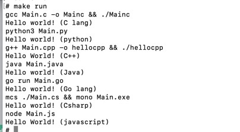

# usage
- ```git clone https://github.com/SnakeSneakS/HelloWorldWithMultipleLanguage.git```
- ```cd HelloWorldWithMultipleLanguage```
- run (or build) docker container ```docker-compose up -d```
- after build finished, enter docker container (maybe ```docker exec -it HelloWorld sh```)
- in container, ```cd Hello``` and ```make run```, then you see you say "Hello world!" using 7 language. 
- exit docker container (maybe ```exit```))
- stop docker container ```docker-compose stop```

# Why 7 language?
- Because today is 7/7 (七夕)(in 2021) 

# result

